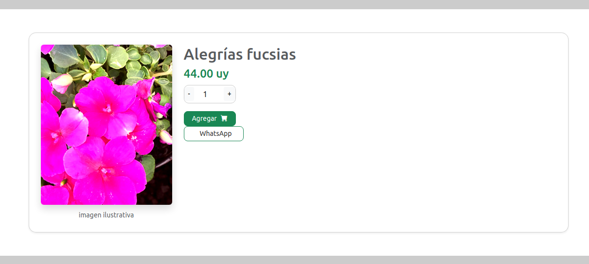
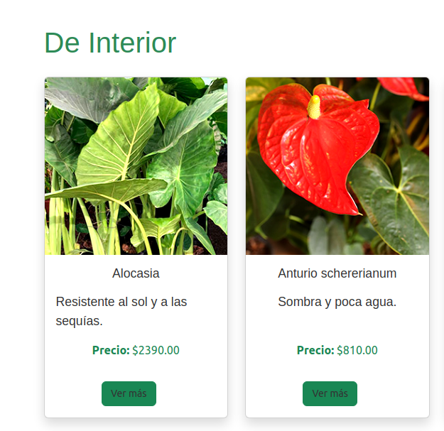
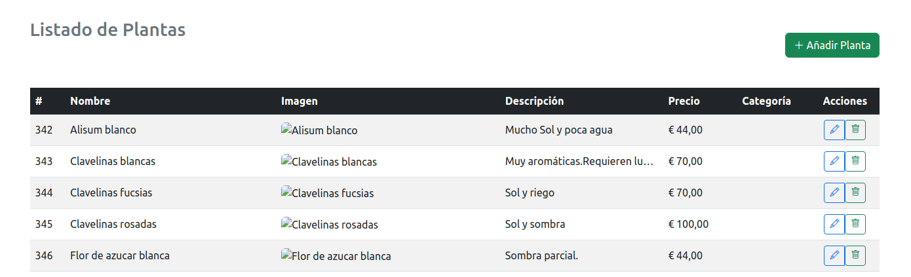

### 🪴 Germina Luz - Web Scraping y Tienda Online de Plantas

Proyecto de desarrollo web, aplicando la herramienta web scraping. Esta aplicación está enfocada para que el usuario haga uso de un servicio de  tienda online. El proyecto consta de productos  sobre plantas de interior y exterior.  
El objetivo es mostrar, gestionar y vender productos obtenidos a través de técnicas de scraping web, organizados por categorías, con detalles como precio, descripción e imagen. La aplicación permite al usuario visualizar productos, agregarlos al carrito y simular compras, mientras que el administrador puede gestionar el catálogo completo (añadir, editar y eliminar plantas).

Está pensado como una tienda online dinámica, accesible desde cualquier dispositivo gracias a su diseño responsive.

## Tecnologías utilizadas

- PHP
- MySQL(modelo relacional con tablas normalizadas: plantas, categorías, imágenes,       usuarios)
- Twig (motor de plantillas).
- Bootstrap (para el diseño responsive y componentes visuales).
- Composer(para gestionar dependencias).
- Apache2 (servidor local configurado para servir el proyecto).
- Selenium + Python (scraping de datos desde un sitio externo).
- Gettext (internacionalización en varios idiomas)  // la primera parte
- JWT (JSON Web Tokens) (para autenticación segura con contraseña hasheada).

## Funcionalidades principales
# Frontend (cliente)
Visualización de productos (plantas) organizados por categorías

Ficha de producto con imagen, descripción, precio y botón de compra

Carrito de compras funcional

Buscador de plantas por nombre

Diseño adaptable con Bootstrap (Responsive).

# Backend (admin)
CRUD completo de productos:

Añadir nueva planta

Editar información existente

Eliminar planta

Acceso solo para administradores mediante token JWT

## Estructura del proyecto

📁 webscraping.local  
├── 📁 database  
│   └── usuarios.sql  
├── 📁 public  
│   └── 📁 api  
│       ├── config/  
│       ├── register.php  
│       └── login.php  
├── 📁 src  
│   └── controller/  
│       └── AuthController.php  
├── 📁 templates  
├── 📁 vendor (Composer)
└── router.php

## Requisitos previos para instalar el proyecto

- PHP 
- MySQL / 
- Composer
- Apache2
- Python 3 + Selenium
- Navegador compatible con cookies y sesiones

## Instalación
Clonar el repositorio :
git clone https://github.com/leticiaCasa13/proyectoweb
Acceder al directorio del proyecto
cd webscraping.local
Instalar las dependencias
composer install

    4.Configurar la base de datos:
a.Crear una base de datos MySQL .

b.Importa el archivo database/usuarios.sql

## CONFIGURACIÓN CON VIRTUALHOST
  /etc/apache2/sites-available/webscraping.local.conf            
<VirtualHost *:80>
    ServerName webscraping.local
    DocumentRoot /var/www/webscraping.local/public

    <Directory /var/www/webscraping.local/public>
        AllowOverride All
        Require all granted
    </Directory>

    ErrorLog ${APACHE_LOG_DIR}/webscraping_error.log
    CustomLog ${APACHE_LOG_DIR}/webscraping_access.log combined
</VirtualHost>

## Base de Datos

Este proyecto incluye un archivo `.sql` para que puedas importar la estructura y datos necesarios.

 Archivo incluido

`database/usuarios.sql`

 Cómo importar la base de datos

1. Abrí **phpMyAdmin** o tu gestor de bases de datos favorito.
2. Creá una base de datos nueva (por ejemplo, `webscraping`).
3. Seleccioná la base de datos recién creada.
4. Hacé clic en la pestaña **Importar**.
5. Subí el archivo `usuarios.sql` que está en la carpeta `database/`.
6. Hacé clic en **Continuar**.

Con esto, tendrás todas las tablas necesarias (`plantas`, `categorias`, `imagenes`, `usuarios`, etc.) creadas con sus datos correspondientes.

## Scraping (opcional)
Desde la carpeta scripts podés ejecutar el scraping con:
python scraper.py

Esto actualizará la base de datos con nuevas plantas desde el sitio origen.

El scraping se hizo desde la url https://www.lavender.com.uy/

## Capturas de pantalla 

Home con el logo

Ficha de producto

Página del carrito

Panel de administración con editar, actualizar, borrar y añadir producto

### 🖼️ Capturas de pantalla

#### Página principal

#### Carrito de compras

#### CRUD de categorías

#### CRUD de plantas

